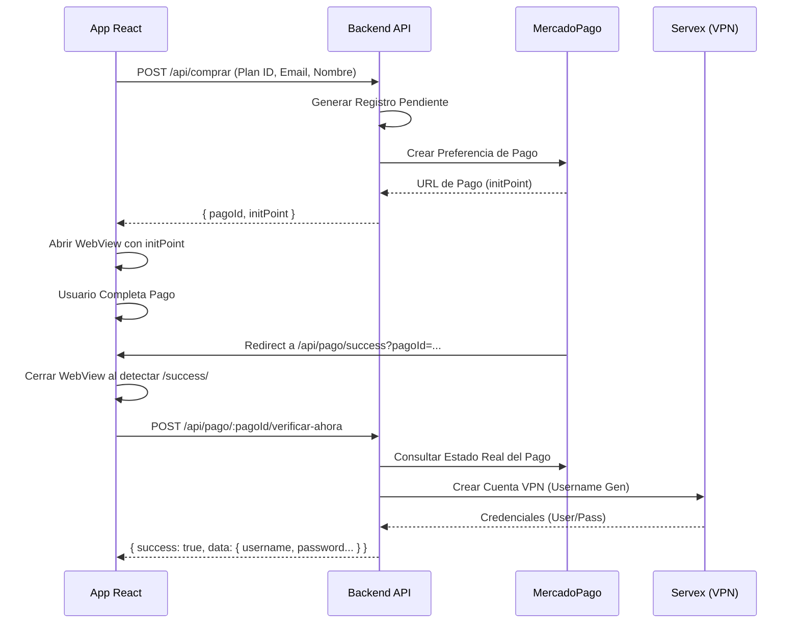

# 🛡️ Guía Profesional de Integración: Compra de Planes VPN

Esta documentación técnica detalla cómo integrar el flujo completo de compra y activación de cuentas VPN de **SecureShop** directamente en tu aplicación **React**.

---

## 1. Arquitectura del Flujo

Para replicar el comportamiento del frontend web en la aplicación móvil, el sistema sigue una arquitectura de cuatro capas: **Aplicación (React)**, **Backend API**, **MercadoPago** y **Servex**.

### Diagrama de Secuencia


---

## 2. Gestión de Identidad y Servex

Tu backend utiliza una lógica específica para que las cuentas de Servex sean compatibles con los nombres de tus clientes.

### Generación Automática de Username
Cuando envías el `clienteNombre`, el backend realiza lo siguiente:
1.  **Limpieza**: Remueve acentos, espacios y caracteres especiales.
2.  **Truncado**: Toma los primeros **7 caracteres** del nombre.
3.  **Variación**: Añade 2 números aleatorios y 3 caracteres aleatorios finales.
4.  **Límite**: Asegura que el nombre de usuario nunca exceda los **12 caracteres** (límite de la API de Servex).

> [!IMPORTANT]
> Es vital que el usuario ingrese un nombre real en la app para que su usuario VPN sea reconocible (ej: `marcos35f1z`).

---

## 3. Implementación de la API (Endpoints)

### A. Obtener Catálogo
**Endpoint:** `GET /api/planes`
Usa este endpoint para dibujar las tarjetas en tu app.

### B. Iniciar Compra
**Endpoint:** `POST /api/comprar`

| Parametros | Tipo | Requerido | Descripción |
| :--- | :--- | :--- | :--- |
| `planId` | Number | Sí | El ID comercial del plan (ej: 56). |
| `clienteNombre` | String | Sí | Nombre del usuario (base para el username VPN). |
| `clienteEmail` | String | Sí | Donde recibirá el comprobante y credenciales. |
| `codigoCupon` | String | No | Código de descuento si el usuario tiene uno. |
| `codigoReferido`| String | No | Código de referido para acreditar comisiones. |

**Ejemplo React:**
```typescript
const startPurchase = async (planId: number, name: string, email: string) => {
  const result = await fetch('https://shop.jhservices.com.ar/api/comprar', {
    method: 'POST',
    headers: { 'Content-Type': 'application/json' },
    body: JSON.stringify({
      planId,
      clienteNombre: name,
      clienteEmail: email
    })
  });
  return await result.json();
};
```

---

## 4. El WebView y la Redirección

En React, debes usar un componente de WebView que monitoree los cambios de estado (`onNavigationStateChange` o similar).

**Lógica de Intercepción:**
1.  Cargar `initPoint`.
2.  Si la nueva URL contiene `/api/pago/success`:
    - El pago fue aprobado. **Cerrar WebView**.
    - Mostrar pantalla de "Activando cuenta...".
3.  Si la nueva URL contiene `/api/pago/failure` o `pending`:
    - Mostrar error al usuario.

---

## 5. Activación Final (Verificar Ahora)

Este es el paso más importante. No esperes al Webhook (que puede tardar). Tu app debe forzar la activación.

**Endpoint:** `POST /api/pago/:pagoId/verificar-ahora`

**Respuesta Exitosa (HTTP 200):**
```json
{
  "success": true,
  "data": {
    "id": "uuid...",
    "estado": "aprobado",
    "servex_username": "nombre123",
    "servex_password": "password456",
    "servex_expiracion": "2026-05-30",
    "plan_nombre": "Plan Empresa 30D"
  }
}
```

---

## 6. Manejo de Errores Comunes

- **"No hay categorías activas"**: Error del backend cuando Servex no tiene configurada una categoría vigente. Notificar al administrador.
- **"Saldo insuficiente"**: Ocurre si el usuario intenta pagar con wallet y no tiene fondos suficientes.
- **"Pago no encontrado"**: Ocurre si se intenta verificar un ID que no existe en la DB local.

---

## 7. Referencia Rápida para React

```typescript
// Interfaz para el estado de cuenta
interface AccountCredentials {
  username: string;
  password: string;
  expiration: string;
}

// Hook sugerido para verificar estado final
const useFinalizePurchase = (pagoId: string) => {
  const [loading, setLoading] = useState(true);
  const [creds, setCreds] = useState<AccountCredentials | null>(null);

  useEffect(() => {
    const verify = async () => {
      const resp = await fetch(`/api/pago/${pagoId}/verificar-ahora`, { method: 'POST' });
      const json = await resp.json();
      if (json.success) {
         setCreds({
           username: json.data.servex_username,
           password: json.data.servex_password,
           expiration: json.data.servex_expiracion
         });
      }
      setLoading(false);
    };
    verify();
  }, [pagoId]);

  return { loading, creds };
};
```
